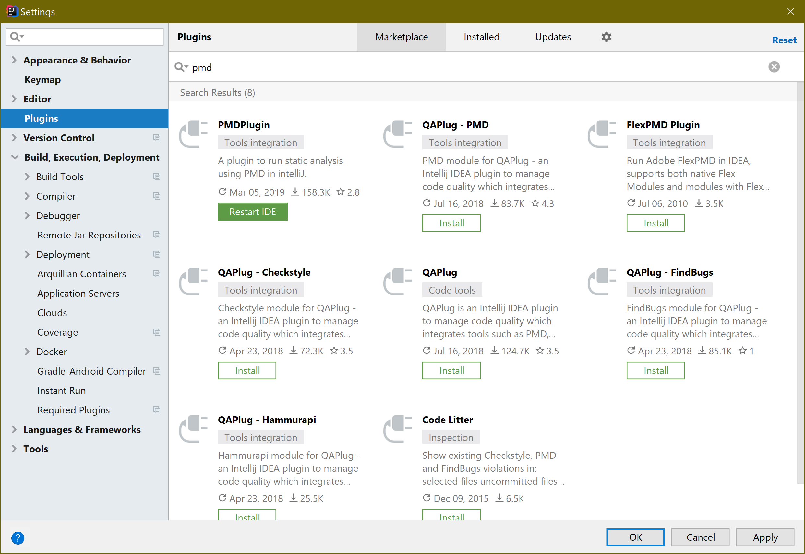

# Lab 10: Code Quality

In this lab we will install a final plugin for IntelliJ that will help our overall code quality.  PMD does not officially an acronym, although a commonly used one is *Programming Mistake Detector.*  PMD is a *static analysis tool*.  It analyses the static (pre-compiled) properties of our code and makes suggestions based on the outcome of the analysis.

## Installing PMDPlugin

In IntelliJ, **select File then Settings** to open the **Settings Window**.  **Select Plugins on the left** and search for **PMDPlugin**.

**Install** the plugin and **Restart IntelliJ**.

## Using PMD

PMD integrates directly into IntelliJ and provides easy access to its features.  It can also be added as part of your Maven configuration but requires further setup.  We will use PMD directly from IntelliJ.  Only one check will be demonstrated and you should explore the others yourself to improve quality.

In IntelliJ, **select Tools then Run PMD, Pre Defined and finally category.java/bestpractices.**  PMD will run and the output appear at the bottom of the window:

PMD has highlighted a number of areas where the quality of our code can be improved.  If you have an `UnusedImports` violation, open the section to see the violations.  Click on one, and it will show you were you have an unused import.  For example, my `AppIntergrationTest` file had `org.junit.jupiter.api.TestInstance` and `java.util.ArrayList` as unused.  So I deleted those lines.  The code is now cleaner, and will take less time to compile.

## Exercise

Your task now is to work through the violations in all the different rule sets under **Pre Defined**.  Try and fix as many problems as you can.  Overall, it will improve your code quality in the future as you will recognise these problems before you write code.  PMD will just allow you to spot any violations.